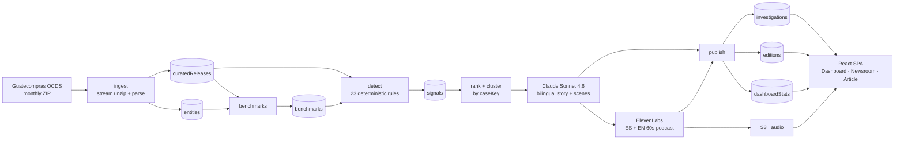
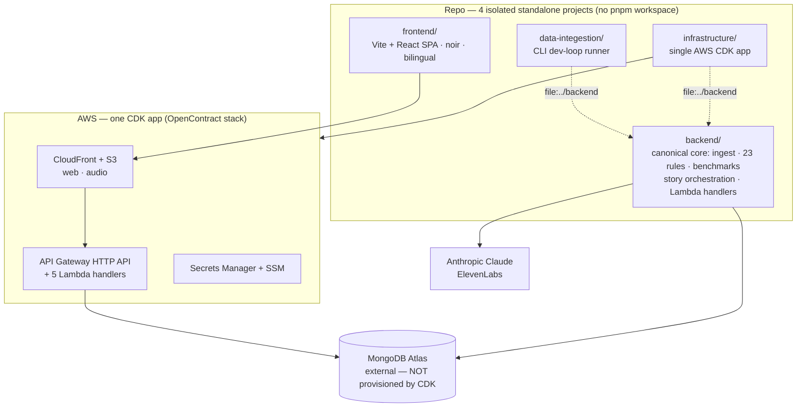

<div align="center">

# Expediente Público
### _Open Contract Newsroom_

**We turn a year of Guatemala's public spending into investigative stories anyone can read, hear, and trust — in 60 seconds.**

`Node 20` · `pnpm 10.13.1` · `TypeScript` · `AWS CDK` · `MongoDB Atlas` · `Claude Sonnet 4.6` · `ElevenLabs` · `Vite + React`

</div>

---

> ⚠️ **This system does not prove corruption.** It surfaces *review signals* —
> contracts and patterns worth investigating by journalists, auditors, and
> civil society. Natural‑person suppliers are anonymized. Every story and
> podcast carries a mandatory caveat. See [The ethical guardrail](#-the-ethical-guardrail).

Every contract the Guatemalan government signs is *already public* — published
on the Guatecompras portal in a raw technical format (OCDS). But "public" is
not the same as "readable." This project ingests ~1 year of that data, detects
unusual patterns with **deterministic rules**, narrates each finding with
**Claude** strictly from the evidence, and presents it as a **cinematic,
bilingual investigation article** with a **60‑second native‑voice podcast**.

> The product name is configurable via `BRAND_NAME` (default: *Expediente
> Público*; EN alias: *Open Contract Newsroom*). It is never hardcoded.

---

## ✨ Why this matters

In this dataset, roughly **94.5% of all public procurement is "direct
purchase"** — money awarded without open competition. That single number
should be on every front page. Today it's invisible — not hidden, but
*unreadable*. Corruption doesn't hide in the dark anymore; it hides in plain
sight, buried under data nobody has time to read.

**Transparency without comprehension isn't transparency.** This is the gap we close:

- 🔍 **Every sentence is traceable.** Click any claim → the exact OCDS field(s)
  and the benchmark it was compared against. A *transparent investigation
  assistant*, not a generic text generator.
- ⚖️ **"Signals, not proof" — enforced in code.** Banned‑phrase + evidence‑mapping
  post‑checks, individual‑supplier anonymization, mandatory caveat, automatic
  deterministic fallback. The system never accuses.
- 🌎 **Bilingual end‑to‑end.** UI, story, and a 60s podcast in **native Spanish
  and English** voices — generated, not robot‑translated.
- 🎬 **Investigative‑noir cinematic article.** Near‑black canvas, blood‑red
  accent, chaptered scrollytelling with motion design and a buyer↔supplier
  relationship graph that builds itself.
- 🔁 **Fully pre‑generated & idempotent.** One deterministic pipeline run →
  infinite fast, static reads. No live LLM calls while browsing.
- 🧩 **Built on a global standard.** Guatecompras follows **OCDS**, used by
  dozens of countries. Guatemala is the proof; the engine is the product.

---

## 🧭 What it does — the pipeline in one picture



| Stage | Command | Reads | Writes |
|---|---|---|---|
| **Ingest** | `cli ingest` | Guatecompras monthly ZIP | `curatedReleases`, `entities` |
| **Benchmarks** | `cli benchmarks` | `curatedReleases`, `entities` | `benchmarks` |
| **Detect** | `cli detect` | `curatedReleases`, `benchmarks` | `signals` |
| **Generate** | `cli generate` | `signals`, `entities`, `benchmarks` | `investigations`, `editions`, `dashboardStats`, S3 audio |
| **Publish** | `cli publish` | ranked cases | `investigations`, `editions`, `dashboardStats` |

`generate` chains **rank → story (Claude) → audio (ElevenLabs) → publish** in
one command. The SPA only ever reads pre‑generated data — never the LLM.

---

## 🏗️ Architecture



- **`backend/`** — the canonical core. OCDS types, the `CuratedRelease` schema,
  config loader, Mongo client, every pipeline stage, and thin Lambda handlers.
  **Never imports the AWS SDK** (purity rule).
- **`data-integestion/`** — the CLI dev‑loop runner; consumes `backend` via
  `file:../backend`. (The folder name is misspelled *on purpose* — do not "fix" it.)
- **`frontend/`** — isolated Vite + React SPA. No backend dependency; talks to
  the API over HTTP only.
- **`infrastructure/`** — one AWS CDK app; bundles `backend` handlers. **MongoDB
  Atlas is external and intentionally NOT provisioned by CDK** — the app only
  consumes `MONGODB_URI`.

---

## 📋 Prerequisites

| Need | Why |
|---|---|
| **Node ≥ 20** (`.nvmrc`) | Runtime; uses Node's built‑in `--env-file` (no `dotenv`) |
| **pnpm 10.13.1** | Pinned `packageManager` in every project |
| **MongoDB Atlas cluster** | External/pre‑existing. Public SRV + allowlist `0.0.0.0/0` + strong creds + TLS (no VPC/NAT) |
| **Anthropic API key** | Claude Sonnet 4.6 — bilingual story generation |
| **ElevenLabs key + 2 voice IDs** | Native ES & EN 60‑second podcasts |
| **AWS account + CDK** | Deploy only (S3/CloudFront/API GW/Lambda). Not needed for local runs |

---

## 🚀 Quickstart (local)

```bash
# 1. Configure environment (repo root)
cp .env.example .env
#    → fill MONGODB_URI (required). For full pipeline also set
#      ANTHROPIC_API_KEY, ELEVENLABS_API_KEY, ELEVENLABS_VOICE_ES/EN, AUDIO_BUCKET

# 2. Install + build the canonical core, then the CLI runner
pnpm --dir backend install
pnpm --dir backend build
pnpm --dir data-integestion install

# 3. Smoke‑test the database connection
pnpm --dir data-integestion cli ensure-indexes   # create/verify all indexes (idempotent)
pnpm --dir data-integestion cli ping              # prints "ok" if Atlas is reachable

# 4. Run the frontend
pnpm --dir frontend install
pnpm --dir frontend dev                           # http://localhost:5173
```

> Point the SPA at your API with `VITE_API_BASE_URL` (e.g. `https://<cf-domain>/api`,
> or a local proxy). It is injected at **build time**, not read in Node.

---

## ⚙️ Run the pipeline (step by step)

All stages run through the CLI: `pnpm --dir data-integestion cli <command>`.
The `.env` at the repo root is loaded automatically (`--env-file-if-exists`).
See every command with `pnpm --dir data-integestion cli --help`.

```bash
# 1 ─ INGEST one month  (month is NOT zero-padded; returns a ZIP)
pnpm --dir data-integestion cli ingest --year 2025 --month 8
pnpm --dir data-integestion cli ingest --year 2025 --month 8 --dry-run   # no DB writes
pnpm --dir data-integestion cli ingest --year 2025 --month 8 --spike     # ZIP-structure probe

# 2 ─ BENCHMARKS over the full ingested scope
pnpm --dir data-integestion cli benchmarks
pnpm --dir data-integestion cli benchmarks --scope "scope:2025-08..2026-07"
pnpm --dir data-integestion cli benchmarks --dry-run

# 3 ─ DETECT — the 23 deterministic rules
pnpm --dir data-integestion cli detect
pnpm --dir data-integestion cli detect --scope "scope:2025-08..2026-07"

# 4 ─ GENERATE — rank → Claude story (ES+EN) → ElevenLabs podcast → publish
pnpm --dir data-integestion cli generate
pnpm --dir data-integestion cli generate --scope "scope:2025-08..2026-07"

# (alt) PUBLISH only — rank → publish, no LLM / no audio
pnpm --dir data-integestion cli publish
```

**Bulk‑load several months, then build everything:**

```bash
for m in 8 9 10 11 12; do
  pnpm --dir data-integestion cli ingest --year 2025 --month "$m"
done
pnpm --dir data-integestion cli benchmarks
pnpm --dir data-integestion cli detect
pnpm --dir data-integestion cli generate
```

**Ordering & toggles**

- Strict order: `ingest → benchmarks → detect → generate/publish`. Benchmarks
  needs releases; detection needs benchmarks; generation needs signals.
- Stage toggles (env): `RUN_BENCHMARKS`, `RUN_DETECTION`, `RUN_STORY`,
  `RUN_AUDIO`, `RUN_PUBLISH` (all default `true`), and `INGEST_ONLY=true` to
  bulk‑ingest and skip everything downstream.
- **Idempotent everywhere:** re‑ingest any month in any order (guarded
  keep‑latest upsert by `ocid`); unchanged cases are skipped on re‑publish via
  an `evidenceHash` guard — so re‑runs don't waste Claude/ElevenLabs budget.
- `generate` needs `ANTHROPIC_API_KEY`; audio upload also needs `ELEVENLABS_*`
  and `AUDIO_BUCKET` (audio is skipped cleanly if the bucket is unset).

---

## 🔧 Configuration reference

Copy `.env.example` → `.env`. Validated by `backend/src/config/env.ts` (Zod).

| Variable | Required | Default | Purpose |
|---|---|---|---|
| `MONGODB_URI` | **Yes** | — | MongoDB Atlas SRV connection string |
| `ANTHROPIC_API_KEY` | For story | — | Claude Sonnet 4.6 story generation |
| `OPUS_LEAD` | No | `false` | Use Opus for the lead investigation (stretch) |
| `ELEVENLABS_API_KEY` | For audio | — | ElevenLabs TTS |
| `ELEVENLABS_VOICE_ES` / `_EN` | For audio | — | Separate native ES / EN voice IDs |
| `ELEVENLABS_SPEED` | No | `0.85` | Narration speed (0.7–1.2; <1.0 = slower) |
| `AUDIO_BUCKET` | For audio | — | S3 bucket for generated MP3s |
| `MAX_INVESTIGATIONS_PER_RUN` | No | `20` | Cost guard — cases generated per run |
| `EVIDENCE_SAMPLE_PER_RULE` | No | `6` | Evidence rows sampled per rule in the prompt |
| `MAX_REPRESENTATIVE_EVIDENCE` | No | `60` | Max evidence rows sent to the prompt |
| `MAX_PERSISTED_EVIDENCE` | No | `300` | Evidence array floor stored per investigation |
| `MAX_SCENE_SIGNALS_PER_RULE` | No | `8` | Per‑rule cap for scene derivation |
| `RUN_BENCHMARKS` / `RUN_DETECTION` / `RUN_STORY` / `RUN_AUDIO` / `RUN_PUBLISH` | No | `true` | Per‑stage toggles |
| `INGEST_ONLY` | No | `false` | Ingest only, skip downstream stages |
| `BRAND_NAME` | No | `Expediente Público` | Configurable product name |
| `BRAND_TAGLINE` | No | _empty_ | Optional tagline |
| `LOG_LEVEL` | No | `info` | `fatal\|error\|warn\|info\|debug\|trace\|silent` |
| `LOG_DIR` | No | `./logs` (`/tmp/logs` in Lambda) | Log + publish‑artifact dir |
| `PUBLISH_ARTIFACTS` | No | `true` | Dump each investigation to disk before upsert |
| `VITE_API_BASE_URL` | Frontend | `/api` | SPA API base URL (build‑time, `VITE_` prefix) |

---

## 🧠 How detection works

Detection is **100% deterministic** — no LLM. A pluggable rule engine emits
`signals` with evidence; the LLM only narrates them afterward.

- **23 rules across 4 families:** competition & method abuse · supplier
  concentration & networks · pricing anomalies · timing, splitting & integrity.
- **Hero rule — supplier concentration per buyer (#7):** one supplier capturing
  a large share of an institution's awarded value, reinforced by
  low‑competition and direct‑award signals. This headlines the flagship article.
- **Review Priority, not a score.** Output is **High / Med / Low + the list of
  fired signals** — never a single "corruption score."
- **LCE legal bands (GTQ):** `≤ Q90,000` direct purchase · `Q90k–Q900k`
  quotation · `> Q900k` public tender. Thresholds live in a single configurable
  `RuleConfig` — no magic numbers in rule bodies, so re‑running is reproducible.

---

## ⚖️ The ethical guardrail

Non‑negotiable, and enforced in code + prompts:

- The system **never says "this is corruption."** It says "review signal" /
  "unusual vs comparable contracts."
- **Every claim is evidence‑bound** — backed by the exact OCDS field(s) + a
  benchmark; quantitative scene params are validated against the deterministic
  evidence and rejected otherwise.
- **Natural‑person suppliers are anonymized** at the LLM layer (rendered "an
  individual supplier" / "un proveedor individual"); raw names stay internal only.
- **Mandatory caveat** in every story and every podcast (text + audio, ES + EN).
- **Guardrail‑fail behavior:** on a banned phrase, an unbacked claim, or a name
  leak — retry once with a stricter instruction; if it still fails, publish the
  **deterministic evidence‑only summary**. The pipeline never blocks.

This restraint is the feature: it's what makes the output usable by a
journalist, auditor, or institution without legal risk.

---

## 🎬 The frontend experience

A Vite + React SPA in an **investigative‑noir** design system (near‑black,
blood‑red accent, condensed display type, film‑grain/duotone), fully
**bilingual ES/EN** via i18next.

| Route | View |
|---|---|
| `/` | **Dashboard** — national procurement radar + animated stats |
| `/newsroom` | **Newsroom** — featured Edition + filterable investigation feed |
| `/investigation/:caseKey` | **Cinematic Article** — the flagship experience |
| `/methodology` | **Methodology / About** — data source, limits, "signals not proof" |

The Article is a chaptered scrollytelling experience on a fixed spine —
**Cover · El Caso · Sigue el Dinero · Las Conexiones · Evidencia · Cronología ·
Cierre** — rendered from a finite **Scene Catalog**. The 7 core scenes:
`CoverHeadline`, `CaseStatement`, `MoneyFlowStreams`, `ConcentrationFan`,
`EvidenceLedger`, `AwardTimeline`, `ClosingStatement`. The LLM only *selects* a
scene from a rule‑filtered shortlist and fills typed params; a guaranteed
default scene renders on any failure. Scroll mode ships; Presentation & Podcast
modes layer on top.

---

## ☁️ Deploy to AWS

Everything except the external Atlas is one CDK app (the `OpenContract` stack:
S3 web/audio buckets, CloudFront, HTTP API + 5 Lambda handlers, Secrets
Manager, SSM).

```bash
# 0. One-time CDK bootstrap for the account/region
pnpm --dir infrastructure exec cdk bootstrap aws://<ACCOUNT_ID>/us-east-1

# 1. Build the canonical core (CDK bundles backend/src/handlers)
pnpm --dir backend install && pnpm --dir backend build
pnpm --dir infrastructure install

# 2. Preview, then deploy
pnpm --dir infrastructure diff
pnpm --dir infrastructure deploy        # CDK waits for ACM DNS validation

# 3. Set secrets/params out-of-band (created empty by CDK)
aws secretsmanager put-secret-value --secret-id open-contract/MONGODB_URI       --secret-string '<srv-uri>'
aws secretsmanager put-secret-value --secret-id open-contract/ANTHROPIC_API_KEY --secret-string '<key>'
aws secretsmanager put-secret-value --secret-id open-contract/ELEVENLABS_API_KEY --secret-string '<key>'
aws ssm put-parameter --overwrite --name /open-contract/ELEVENLABS_VOICE_ES --type String --value '<id>'
aws ssm put-parameter --overwrite --name /open-contract/ELEVENLABS_VOICE_EN --type String --value '<id>'

# 4. Build + upload the SPA (CDK seeds a placeholder only)
pnpm --dir frontend build               # VITE_API_BASE_URL baked in at build time
aws s3 sync ./frontend/dist s3://<WebBucketName>/ --delete
```

CDK outputs: `SiteUrl`, `ApiEndpoint`, `DistributionDomainName`,
`WebBucketName`, `AudioBucketName`, `DnsSetupInstruction` (the CNAME to add at
your DNS provider). The Atlas cluster must already exist — CDK only stores its
URI as a secret.

---

## 🗂️ Project layout & conventions

This repo is **four fully isolated, standalone TypeScript projects** — there is
**no pnpm workspace** and no `pnpm -r`. Every command is run **per folder** with
`pnpm --dir <folder> …`.

| Folder | Role |
|---|---|
| `backend/` | **Canonical** shared code: OCDS types, `CuratedRelease` Zod schema, config loader, memoized Mongo client, pipeline stages, Lambda handlers |
| `data-integestion/` | Dev‑loop **CLI runner**; consumes `backend` via `file:../backend` |
| `frontend/` | Vite + React SPA (no backend dep) |
| `infrastructure/` | Single AWS CDK app; bundles `backend` handlers |

> The folder name `data-integestion` is spelled exactly that way **on purpose** — do not "fix" it.

**Why no workspace.** Each folder installs and builds in isolation so the
Lambda/CDK bundling, the CLI dev loop, and the SPA never share a hoisted
`node_modules` or a single root build graph. There is **no `@core` alias**: the
shared code *is* the `backend` package, consumed through a local `file:`
dependency (`"backend": "file:../backend"`).

**Purity rule.** `backend/src/` must **never** import `@aws-sdk` or `aws-sdk`.
AWS SDK usage lives only in `data-integestion/` and `infrastructure/`. Lambda
handlers in `backend/src/handlers/` are thin and import `aws-lambda` type‑only.

**`file:` re‑link step (important).** `data-integestion` and `infrastructure`
depend on `backend` via `file:../backend`. After editing `backend`, rebuild it
(`pnpm --dir backend build`) and **re‑install in the consumer**
(`pnpm --dir data-integestion install`) before the built output is visible.
pnpm *copies* (not symlinks) the package — adding new `backend/src` files
without re‑linking causes `ERR_MODULE_NOT_FOUND`. In dev the `cli` script uses
`tsx`, which runs `backend` TypeScript source directly, so a rebuild is not
required for the CLI dev loop.

**Env loading.** No `dotenv`. The CLI uses
`node --env-file-if-exists=../.env --import tsx src/cli.ts`, so offline commands
(`--help`) work even with no `.env`, while `cli ping` still needs a real
`MONGODB_URI`. `.env` is git‑ignored; `.env.example` is the committed template.

**Shared root config (by path, not workspace).** `tsconfig.base.json`,
`eslint.config.mjs` (ESLint 9 flat config), `.prettierrc`, `.editorconfig`,
`.nvmrc`, `.gitignore`, `.env.example`. Each folder's `tsconfig.json` does
`"extends": "../tsconfig.base.json"`.

**Scene contract.** The frontend's scene‑param schema is hand‑mirrored from the
backend; re‑sync with `pnpm --dir backend run sync:scene-contract`.

**Scaffolding a new isolated folder.** Follow the same baseline: its own
`package.json` (`private`, `type: "module"`, `engines.node: ">=20"`, pinned
`packageManager`), a `tsconfig.json` that `extends "../tsconfig.base.json"`,
lint via `--config ../eslint.config.mjs`, and Vitest for tests — never a
workspace, never a `@core` alias; consume shared code via `"backend": "file:../backend"`.

---

## 🧪 Testing & quality

Run per folder (Vitest; ESLint 9 flat config; TypeScript strict):

```bash
pnpm --dir backend          test   # vitest run
pnpm --dir data-integestion test
pnpm --dir frontend         test   # jsdom + Testing Library

pnpm --dir <folder> lint           # backend/data-integestion: --config ../eslint.config.mjs
pnpm --dir <folder> typecheck      # tsc --noEmit / tsc -b
```

---

## 🌍 Scaling & vision

Guatecompras publishes **OCDS — the global Open Contracting Data Standard**,
used by dozens of countries. The engine is built on the standard, not on one
country's quirks: the same pipeline can light up public spending anywhere OCDS
exists. The whole pipeline is **pre‑generated, idempotent, and `evidenceHash`‑
deduplicated**, so it's cheap to operate and always instant for the reader —
and the monthly EventBridge cron is scheduled for a safe day so it never fires
mid‑demo.

**Public money should be legible to the public.** That's what this builds —
transparency you can actually read, and hear.

---

## 📚 More

- Product pitch & deck: [`pitch/summary_idea.md`](./pitch/summary_idea.md), [`pitch/presentation.md`](./pitch/presentation.md)
- Full product spec: [`planning/idea/`](./planning/idea/) (start at `README.md`)
- License: see [`LICENSE`](./LICENSE)

> **Reminder:** this system surfaces *review signals*, not proof of wrongdoing.
> Entities are public institutions and awarded suppliers already published in
> Guatecompras; natural‑person suppliers are anonymized; no private data is
> introduced.
